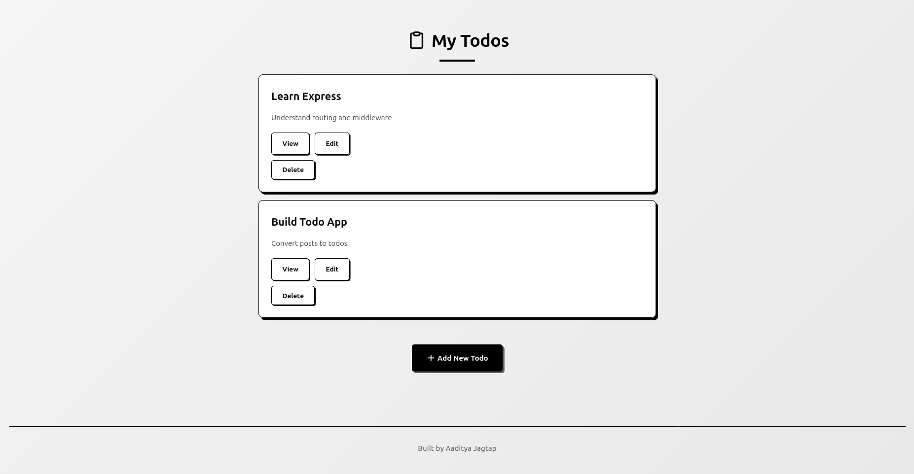
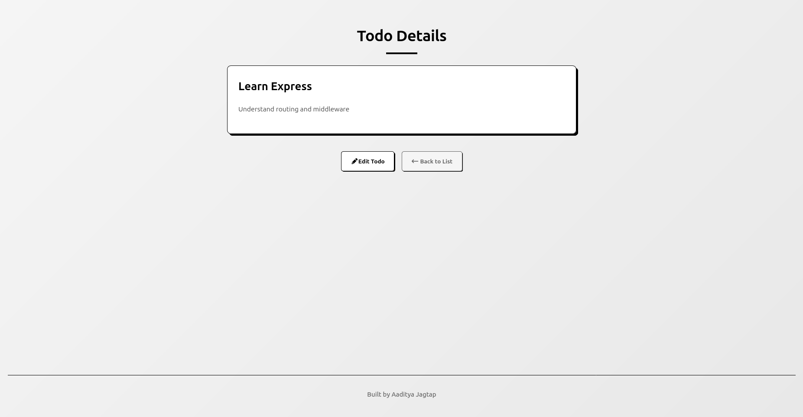
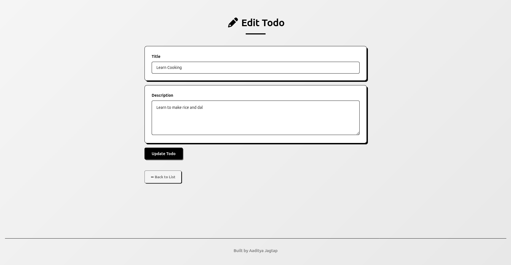
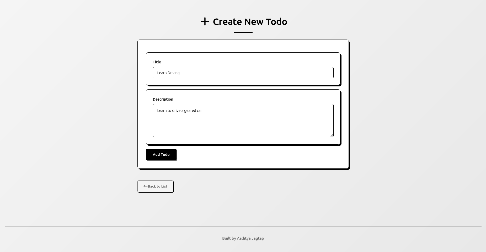

# 📝 Task Management Web Application

A clean, minimal, and professional task management application built with Node.js and Express. This project demonstrates full-stack development fundamentals with CRUD operations, RESTful API design, and a responsive black-and-white themed UI.

**Developer:** Aaditya Jagtap

---

## 🎯 Project Overview

This task management system allows users to efficiently manage their daily tasks with an intuitive interface. The application follows modern web development practices with a focus on code quality, user experience, and clean architecture.

---

## ✨ Features

- **Create Tasks** - Add new tasks with title and description
- **View Tasks** - Display all tasks in a clean, organized list
- **Update Tasks** - Edit existing task details
- **Delete Tasks** - Remove completed or unwanted tasks
- **Responsive Design** - Works seamlessly across desktop, tablet, and mobile devices
- **Professional UI** - Minimalist black-and-white theme with smooth animations

---

## 🛠️ Tech Stack

**Frontend:**
- HTML5
- CSS3 (Custom styling with animations)
- EJS (Embedded JavaScript Templates)

**Backend:**
- Node.js
- Express.js
- UUID (for unique task IDs)
- Method-Override (for PUT/DELETE requests)

**Data Storage:**
- In-memory storage (easily replaceable with database)

---

## 📁 Project Structure

```
task-management-app/
│
├── views/
│   ├── index.ejs          # Main task list page
│   ├── new.ejs            # Create new task form
│   ├── show.ejs           # View single task details
│   └── edit.ejs           # Edit task form
│
├── public/
│   └── style.css          # Application styles
│
├── index.js               # Main server file
├── package.json           # Dependencies
└── README.md              # Documentation
```

---

## 🚀 Getting Started

### Prerequisites

- Node.js (v14 or higher)
- npm (Node Package Manager)

### Installation

1. **Clone the repository**
   ```bash
   git clone <repository-url>
   cd task-management-app
   ```

2. **Install dependencies**
   ```bash
   npm install
   ```

3. **Start the server**
   ```bash
   node index.js
   ```

4. **Open your browser**
   ```
   Navigate to: http://localhost:8080
   ```

---

## 📦 Dependencies

```json
{
  "express": "^4.18.2",
  "ejs": "^3.1.9",
  "uuid": "^9.0.0",
  "method-override": "^3.0.0"
}
```

Install all dependencies with:
```bash
npm install express ejs uuid method-override
```

---

## 🎨 API Endpoints

| Method | Endpoint | Description |
|--------|----------|-------------|
| GET | `/` | Redirects to `/todos` |
| GET | `/todos` | Display all tasks |
| GET | `/todos/new` | Show create task form |
| POST | `/todos` | Create a new task |
| GET | `/todos/:id` | View single task |
| GET | `/todos/:id/edit` | Show edit task form |
| PATCH | `/todos/:id` | Update a task |
| DELETE | `/todos/:id` | Delete a task |

---

## 💡 Key Highlights

### Clean Code Architecture
- Modular routing structure
- RESTful API design principles
- Separation of concerns

### User Experience
- Intuitive navigation
- Smooth animations and transitions
- Empty state handling
- Responsive button layouts

### Design Philosophy
- Minimalist black-and-white aesthetic
- Brutalist-inspired UI with bold borders
- Professional typography and spacing
- Mobile-first responsive design

---

## 🔄 Future Enhancements

- [ ] Database integration (MongoDB/PostgreSQL)
- [ ] User authentication and authorization
- [ ] Task categories and tags
- [ ] Due dates and reminders
- [ ] Search and filter functionality
- [ ] Task completion status toggle
- [ ] Export tasks to CSV/PDF
- [ ] Dark mode support

---

## 📝 Assignment Compliance

This project fulfills all requirements of the **Global Trend Full Stack Development Internship** assignment:

✅ **Frontend** - Responsive UI with HTML, CSS, and EJS templating  
✅ **Backend** - RESTful API with Express.js  
✅ **CRUD Operations** - Complete Create, Read, Update, Delete functionality  
✅ **Code Quality** - Clean, organized, and well-documented code  
✅ **Problem-Solving** - Efficient routing and data management  

---

## 👨‍💻 Developer

**Aaditya Jagtap**

Built as part of the Global Trend Full Stack Development Internship assessment.

---

## 📄 License

This project is open source and available for educational purposes.

---

## Visual Output:

**1. Index page:**


**2. View page:**


**3. Edit page**


**4. Create page:**


**Note:** This application currently uses in-memory storage for simplicity. For production use, integrate a persistent database like MongoDB, PostgreSQL, or MySQL.
